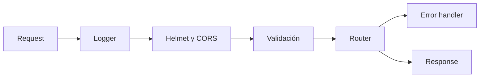
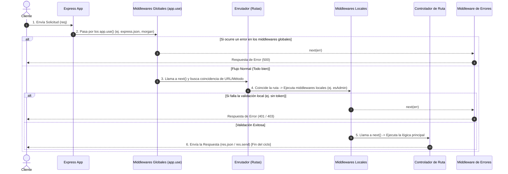

# S20: Middleware, CORS y seguridad básica

## Modelo mental

```mermaid
flowchart LR
  R[Request] --> L[Logger]
  L --> S[Helmet y CORS]
  S --> V[Validación]
  V --> T[Router]
  T --> E[Error handler]
  T --> O[Response]
```

## Diagrama de secuencia

```mermaid
sequenceDiagram
    autonumber
    actor Cliente
    participant App as Express App
    participant Globals as Middlewares Globales (app.use)
    participant Router as Enrutador (Rutas)
    participant Locals as Middlewares Locales
    participant Controller as Controlador de Ruta
    participant ErrorMW as Middleware de Errores

    Cliente->>App: 1. Envía Solicitud (req)
    App->>Globals: 2. Pasa por los app.use() (ej. express.json, morgan)
    
    alt Si ocurre un error en los middlewares globales
        Globals-->>ErrorMW: next(err)
        ErrorMW-->>Cliente: Respuesta de Error (500)
    else Flujo Normal (Todo bien)
        Globals->>Router: 3. Llama a next() y busca coincidencia de URL/Método
        Router->>Locals: 4. Coincide la ruta -> Ejecuta middlewares locales (ej. esAdmin)
        
        alt Si falla la validación local (ej. sin token)
            Locals-->>ErrorMW: next(err)
            ErrorMW-->>Cliente: Respuesta de Error (401 / 403)
        else Validación Exitosa
            Locals->>Controller: 5. Llama a next() -> Ejecuta la lógica principal
            Controller-->>Cliente: 6. Envía la Respuesta (res.json / res.send) [Fin del ciclo]
        end
    end
```
